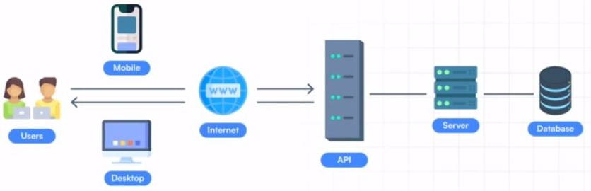

# 🎯 **Explore Browser API and methods :**
## **| 1 | API** - Application Programming Interface **:**
---
## A set of protocols and definitions that allows communication between two applications.

## | 2 | Different types of API :
---
 - **Web APIs :** An application programming interface for the web.
 - **Browser APIs :** Extend the functionality of web browser.
 - **Server APIs :** Extend the functionality of a web server.
 - **Third Party APIs :** are not built into your browser. 
✔ YouTube API 
✔ Twitter API 
✔ Facebook API
## | 3 | Categories of Browser APIs :
---
1 ) **Storage APIs :** Give the ability to store data on the client-side 
&emsp; ✔ Cookies 
&emsp; ✔ Local Storage 
&emsp; ✔ Session Storage 
&emsp; ✔ Indexed DB  
2 ) **Fetch API :**  
&emsp; ✔ Makes asynchronous HTTP requests to a server 
&emsp; ✔ Response format can be JSON, plain text, or XML 
&emsp; ✔ Replacement for old XHR  
3 ) **Form Data API :**  
&emsp; ✔ Constructs a set of key/value pairs 
&emsp; ✔ Represents form fields & values. 
4 ) **Drag-and-Drop API :** Helps to implement drag and drop feature and build image upload system.
&emsp; ✔ Drag and Drop API
&emsp; ✔ File Reader API  
5 ) **DOM API :** Allows to manipulate HTML and CSS in creating, removing and also dynamically applying new styles to your page. 
6 ) **Geolocation API :** Helps to find out the geographical location of an user. 
7 ) **Canvas API:** Supports the creation of graphics using JavaScript and HTML. 
8 ) **Notification API :** Helps to display desktop notifications to users. 
9 ) **History API :** Uses the history.pushState() method. 
10 ) **Audio & Video APIs :** Can manage, display and create different media types. 
&emsp; ✔ Web Audio API 
&emsp; ✔ WebRTC (Web Real-Time Communication) API. 
&emsp; ✔ HTML Media Element 
&emsp; ✔ Media Capture and Streams API  
>## References - Categories of Browser APIs
>https://www.w3schools.com/js/js_api_intro.asp  
>https://www.educative.io/answers/what-are-browser-apis  
>https://www.javascripttutorial.net/web-apis/
## | 4 | BOM vs DOM :
---
 
| BOM | DOM |
|---|---|
|Browser Object Model.|Document Object Model.|
|Used to access and manipulation of the browser window.|Used to manipulate the HTML document.|
|Each browser has its own standards for implementing BOM.|Has a set standard of rules to be used across documents.|
|Consists of the objects navigator, history, screen, location.|Represent the contents of the web page.|
|BOM is a superset of DOM. BOM has many objects, methods and properties that are not part of the DOM structure.|DOM is a subset of BOM|