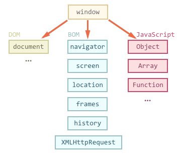
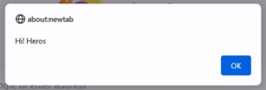
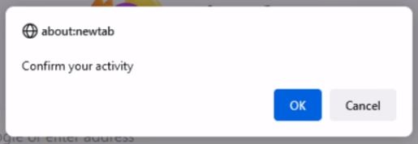
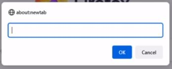
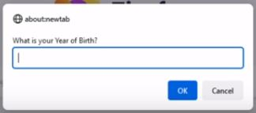
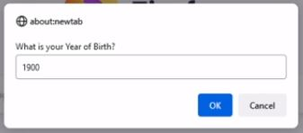

# 🎯 **Explore Browser API and methods :**
## | 1 | API - Application Programming Interface :

### A set of protocols and definitions that allows communication between two applications.

## | 2 | Different types of API :

 - **Web APIs :** An application programming interface for the web.
 - **Browser APIs :** Extend the functionality of web browser.
 - **Server APIs :** Extend the functionality of a web server.
 - **Third Party APIs :** are not built into your browser. 
✔ YouTube API 
✔ Twitter API 
✔ Facebook API
## | 3 | Categories of Browser APIs :

1 ) **Storage APIs :** Give the ability to store data on the client-side 
&emsp; ✔ Cookies 
&emsp; ✔ Local Storage 
&emsp; ✔ Session Storage 
&emsp; ✔ Indexed DB  
2 ) **Fetch API :**  
&emsp; ✔ Makes asynchronous HTTP requests to a server 
&emsp; ✔ Response format can be JSON, plain text, or XML 
&emsp; ✔ Replacement for old XHR  
3 ) **Form Data API :**  
&emsp; ✔ Constructs a set of key/value pairs 
&emsp; ✔ Represents form fields & values. 
4 ) **Drag-and-Drop API :** Helps to implement drag and drop feature and build image upload system. 
&emsp; ✔ Drag and Drop API  
&emsp; ✔ File Reader API  
5 ) **DOM API :** Allows to manipulate HTML and CSS in creating, removing and also dynamically applying new styles to your page. 
6 ) **Geolocation API :** Helps to find out the geographical location of an user. 
7 ) **Canvas API:** Supports the creation of graphics using JavaScript and HTML. 
8 ) **Notification API :** Helps to display desktop notifications to users. 
9 ) **History API :** Uses the history.pushState() method. 
10 ) **Audio & Video APIs :** Can manage, display and create different media types. 
&emsp; ✔ Web Audio API 
&emsp; ✔ WebRTC (Web Real-Time Communication) API. 
&emsp; ✔ HTML Media Element 
&emsp; ✔ Media Capture and Streams API  
>## References - Categories of Browser APIs
>https://www.w3schools.com/js/js_api_intro.asp  
>https://www.educative.io/answers/what-are-browser-apis  
>https://www.javascripttutorial.net/web-apis/
## | 4 | BOM vs DOM :

 
| BOM | DOM |
|---|---|
|Browser Object Model.|Document Object Model.|
|Used to access and manipulation of the browser window.|Used to manipulate the HTML document.|
|Each browser has its own standards for implementing BOM.|Has a set standard of rules to be used across documents.|
|Consists of the objects navigator, history, screen, location.|Represent the contents of the web page.|
|BOM is a superset of DOM. BOM has many objects, methods and properties that are not part of the DOM structure.|DOM is a subset of BOM|

## | 5 | Browser alert, confirm, prompt with examples :
### **3 types of pop-up box :**  
All of the popups open a modal window. 
The user cannot interact with the rest of the components of the web page without responding to this window first. 
&emsp; 1 ) Alert Box.  
&emsp; 2 ) Confirmation Box.  
&emsp; 3 ) Prompt Box.   
### **Alert Box :**
&emsp; 1 ) Used to inform/alert the user and notify about an event. 
&emsp; 2 ) Contains only one button, named 'OK', and returns nothing as output. 
&emsp; 3 ) Regular syntax of it : **alert("message")**  
>`` alert("Hi! Heros"); `` 
> 
### **Confirmation Box :**
&ensp; 1 ) Provides user with a choice and nofify about an event. 
&ensp; 2 ) This type of popup box has two buttons, named 'OK' and 'Cancel', and return 'true' and 'false' depending on the respective button click. 
&ensp; 3 ) Regular syntax of it : **confirm("message")**  
>``confirm("Confirm your activity);`` 
>
### **Alert vs Confirmation :**
|Alert|Confirm|
|---|---|
|Is used if we want the information comes through to the user.|Is used if we want the user to varify or accept something.|
|Need to click "OK" to proceed when an alert box pops up.|Need to click either "OK" or "Cancel" to proceed when a confirmation box pops up.|
|Always return true we always need to click on "OK" to proceed further.|Return true if we click "OK", false if we don't click on "OK".|
### **Prompt Box :**
&ensp; 1 ) Interaction with user is possible by asking the user to input some information. 
&ensp; 2 ) Stores the user information.
&ensp; 3 ) It has button: 'Ok' and 'Cancel'. If the user clicks 'Ok' the box return the input value. If the user clicks 'Cancel' the box returns null. 
&ensp; 4 ) Regular syntax of it : **prompt("message")**.
> ### **3 types of Prompt Box :**
> **First type** (Without message) : 
> ``prompt();`` 
> 
> **Second type** (With message) : 
> ``prompt('What is your Year of Birth?');`` 
> 
> **Third type** (with message and defult value) :
> ``prompt('What is your Year of Birth ?', 1999);`` 
> 